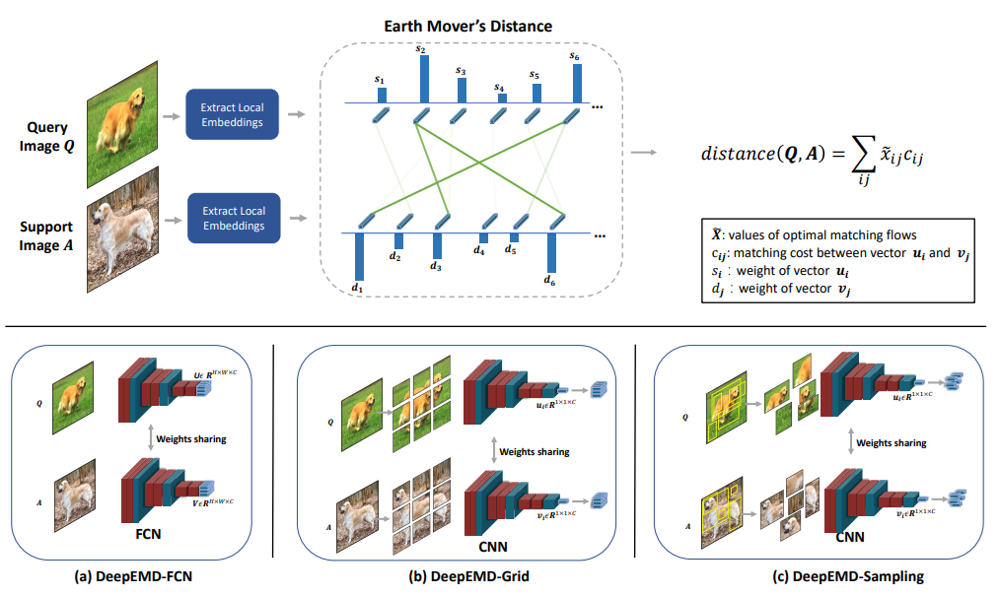

# DeepEMD: Differentiable Earth Mover's Distance for Few-Shot Learning

The code repository for [DeepEMD: Few-Shot Image Classification with Differentiable Earth Mover's Distance and Structured Classifiers](https://arxiv.org/pdf/2003.06777v2.pdf)" (CVPR 2020 oral) and"[DeepEMD: Differentiable Earth Mover's Distance for Few-Shot Learning](https://arxiv.org/pdf/2003.06777.pdf)" (Extension) in PyTorch. 

If you use the code in this repo for your work, please cite the following bib entries:

    @InProceedings{Zhang_2020_CVPR,
    author = {Zhang, Chi and Cai, Yujun and Lin, Guosheng and Shen, Chunhua},
    title = {DeepEMD: Few-Shot Image Classification With Differentiable Earth Mover's Distance and Structured Classifiers},
    booktitle = {IEEE/CVF Conference on Computer Vision and Pattern Recognition (CVPR)},
    month = {June},
    year = {2020}
    }
and

    @misc{zhang2020deepemdv2,
        title={DeepEMD: Differentiable Earth Mover's Distance for Few-Shot Learning},
        author={Chi Zhang and Yujun Cai and Guosheng Lin and Chunhua Shen},
        year={2020},
        eprint={2003.06777v3},
        archivePrefix={arXiv},
        primaryClass={cs.CV}
    }

If you have any question regarding the paper, please send a email to `chi007[at]e[dot]ntu[dot]edu[dot]sg`.

## Abstract

Deep learning has proved to be very effective in learning with a large amount of labelled data. Few-shot learning in contrast attempts to learn with only a few labelled data. In this work, we develop methods for few-shot image classification from a new perspective of optimal matching between image regions. We employ the Earth Mover's Distance (EMD) as a metric to compute a structural distance between dense image representations to determine image relevance. The EMD generates the optimal matching flows between structural elements that have the minimum matching cost, which is used to calculate the image distance for classification. To generate the important weights of elements in the EMD formulation, we design a cross-reference mechanism, which can effectively alleviate the adverse impact caused by the cluttered background and large intra-class appearance variations. To handle k-shot classification, we propose to learn a structured fully connected layer that can directly classify dense image representations with the proposed EMD. Based on the implicit function theorem, the EMD can be inserted as a layer into the network for end-to-end training. Our extensive experiments validate the effectiveness of our algorithm which outperforms state-of-the-art methods by a significant margin on four widely used few-shot classification benchmarks, namely, miniImageNet, tieredImageNet, Fewshot-CIFAR100 (FC100) and Caltech-UCSD Birds-200-2011 (CUB).

## Few-shot classification Results

Experimental results on few-shot learning datasets with ResNet-12 backbone. We report average results with 5,000 randomly sampled episodes for 1-shot evaluation and 600 episodes for k-shot evaluation

**MiniImageNet Dataset**

|  Setups  | 1-Shot 5-Way | 5-Shot 5-Way |   
|:--------:|:------------:|:------------:|
| Previous SOTA |     64.12    |     80.51    |
| **DeepEMD-FCN** |     **66.50**    |     **82.41**    |
|  **DeepEMD-Grid**  |     **67.83**    |     **83.14**    | 
| **DeepEMD-Sampling** |     **68.77**    |     **84.13**    | 

**TieredImageNet Dataset**

|  Setups  | 1-Shot 5-Way | 5-Shot 5-Way |   
|:--------:|:------------:|:------------:|
| Previous SOTA |     68.50    |     84.28    |
| **DeepEMD-FCN** |     **72.65**    |     **86.03**    |
|  **DeepEMD-Grid**  |     **73.13**    |     **87.08**    | 
| **DeepEMD-Sampling** |     **74.29**    |     **86.98**    | 

## Prerequisites

The following packages are required to run the scripts:

- [PyTorch >= version 1.1](https://pytorch.org)

- [QPTH](https://github.com/locuslab/qpth)

- [CVXPY](https://www.cvxpy.org/)

- [OpenCV-python](https://pypi.org/project/opencv-python/)

- [tensorboard](https://www.tensorflow.org/tensorboard)
## Dataset
Please click [here](https://drive.google.com/drive/folders/1sXJgi9pXo8i3Jj1nk08Sxo6x7dAQjf9u?usp=sharing) for downloading the 
following datasets.

### MiniImageNet Dataset

It contains 100 classes with 600 images in each class, which are built upon the ImageNet dataset. The 100 classes are divided into 64, 16, 20 for meta-training, meta-validation and meta-testing, respectively.

### TieredImageNet Dataset
TieredImageNet is also a subset of ImageNet, which includes 608 classes from 34 super-classes. Compared with  miniImageNet, the splits of meta-training(20), meta-validation(6) and meta-testing(8) are set according to the super-classes to enlarge the domain difference between  training and testing phase. The dataset also include more images for training and evaluation (779,165 images in total).

### CUB Dataset
CUB was originally proposed for fine-grained bird classification, which contains 11,788 images from 200 classes. We follow the splits in [FEAT](https://github.com/Sha-Lab/FEAT) that 200 classes are divided into 100, 50 and 50 for meta-training, meta-validation and meta-testing, respectively.

### FC100 Dataset
FC100 is a few-shot classification dataset built on CIFAR100. We follow the split division proposed in [TADAM](https://papers.nips.cc/paper/7352-tadam-task-dependent-adaptive-metric-for-improved-few-shot-learning.pdf), where 36 super-classes were divided into 12 (including 60 classes), 4 (including 20 classes), 4 (including 20 classes), for meta-training, meta-validation and meta-testing, respectively, and each class contains 100 images.

### CIFAR-FS dataset (not in paper)
CIFAR-FS was also built upon CIFAR100,proposed in [here](https://arxiv.org/pdf/1805.08136.pdf). It contains 64, 16, 20 classes for training, validation and testing.

## Important Arguments
We list some important arguments of our networks.
 
**Model Selection Arguments**
- `deepemd`:  choices=['fcn', 'grid', 'sampling']

- `pretrain_dir`:  dir of the pre-trained model

- `model_dir`:  dir of the testing model in `eval.py`

**Solver Selection Arguments**
- `solver`:  choices=['opencv', 'qpth']

- `form`: two ways to use the QPTH for solving EMD, choices=['QP', 'L2']. see codes for detail

- `l2_strength`: the weight for omitting the quadratic term in the form 'L2'

**DeepEMD-FCN Related Arguments**
- `feature_pyramid`: feature pyramid applied to FCN, e.g. `'2,3'`, default: None

**DeepEMD-Grid Related Arguments**
- `patch_list`: the size of grids at every image-pyramid level, e.g. '2,3' means a pyramid with 2×2 and 3×3 structure.
- `patch_ratio`: scale the patch region to incorporate context around the patch 

**DeepEMD-Sampling Related Arguments**
- `num_patch`: the number of sampled patches

**SFC Related Arguments** 
- `sfc_lr`: learning rate for finetuning SFC
- `sfc_wd`: weight decay strength for finetuning SFC
- `sfc_update_step`: number of finetuning step for SFC
- `sfc_bs`: batch size for finetuning SFC

## Some general tips
**Get started.**
The training of our model has two stages, the model pre-training stage (`train_pretrain.py`) and 
the episodic meta-training stage (`train_meta.py`). You may also directly test the trained models by running `eval.py`.
Before running these scripts, please set the dataset directory (`-data_dir`) and pre-trained model directory (`-pretrain_dir`) in the arguments
or directly change the default directories in the code.  

**Solver selection.** We provide two solvers to solve the LP problem in the EMD layer, OpenCV and QPTH. 
OpenCV is much faster than QPTH, therefore you can use OpenCV for validation and QPTH for training. You may also use OpenCV for training, which is much faster and saves memory,
 but this omits the graidents through the constraints and compromises performance. 

**About GPU memory.** There are many arguments that influence the GPU momory. 
You may choose to adjust these arguments to make a blance between GPU memory and performance.

- `solver`: `OpenCV` requires much less GPU memories than `QPTH`. 

- `query`: The number of query images in each class. Play the role of batch size in a task.

- `num_patch`: The number of sampling patches in DeepEMD-Sampling.
 
 - `patch_list`: A list that indicates the grid size at different levels of image-pyramid  in DeepEMD-Grid.

For DeepEMD-Sampling and DeepEMD-Grid, you may choose to train with a small number of patches 
but test with a big number of patches to achieve improved performance. 

## Testing scripts for DeepEMD

Test DeepEMD-FCN with a trained model for 1-shot 5-way task on the miniImageNet dataset:

    $ python eval.py  -deepemd fcn -gpu 0,1,2,3
    
Test DeepEMD-FCN with a trained model for 5-shot 5-way task on the miniImageNet dataset:

    $ python eval.py  -deepemd fcn -shot 5 -test_episode 600 -gpu 0,1,2,3

Test DeepEMD-Gird-Pyramid (2,3) with a trained model for 1-shot 5-way task on the miniImageNet dataset:

    $ python eval.py  -deepemd grid -patch_list 2,3  -gpu 0,1,2,3

Test DeepEMD-Sampling (9-patch) with a trained model for 1-shot 5-way task on the miniImageNet dataset:

    $ python eval.py  -deepemd sampling -num_patch 9   -gpu 0,1,2,3

## Training scripts for DeepEMD
Pre-train the models on the miniImagenet

    $ python train_pretrain.py -dataset miniimagenet -gpu 0,1,2,3
    

Train DeepEMD-FCN with a pre-trained model for 1-shot 5-way task on the miniImageNet dataset:

    #use opencv solver (about 8GB memory)
    $ python train_meta.py -deepemd fcn -shot 1 -way 5 -solver opencv -gpu 0,1,2,3
    
    #use QPTH solver (about 32GB memory)
    $ python train_meta.py -deepemd fcn -shot 1 -way 5 -solver qpth -gpu 0,1,2,3

Train DeepEMD-Gird-Pyramid (2,3) with a pre-trained model for 1-shot 5-way task on the miniImageNet dataset:
 
    #use opencv solver (about 45GB memory)
    $ python train_meta.py  -deepemd grid -patch_list 2,3 -shot 1 -way 5 -solver opencv -gpu 0,1,2,3
        
Train DeepEMD-Sampling (9 patchs) with a pre-trained model for 1-shot 5-way task on the miniImageNet dataset:
 
    #use opencv solver (about 32GB memory)
    $ python train_meta.py  -deepemd sampling -patch_list 9 -shot 1 -way 5 -solver opencv -gpu 0,1,2,3
        
            
## Download  Models

[Pre-trained Models](https://drive.google.com/drive/folders/1ay3FJ4rv8slCt_NNAld2qdt9FTK1cVdT?usp=sharing)

[Meta-trained Models](https://drive.google.com/drive/folders/1PSq6fnDUwajoMixU9dLFQ0OrqFjSq6Wm?usp=sharing)

## Acknowledgment
Our project references the codes in the following repos.
- [FEAT](https://github.com/Sha-Lab/FEAT)

- [MTL](https://github.com/yaoyao-liu/meta-transfer-learning)

